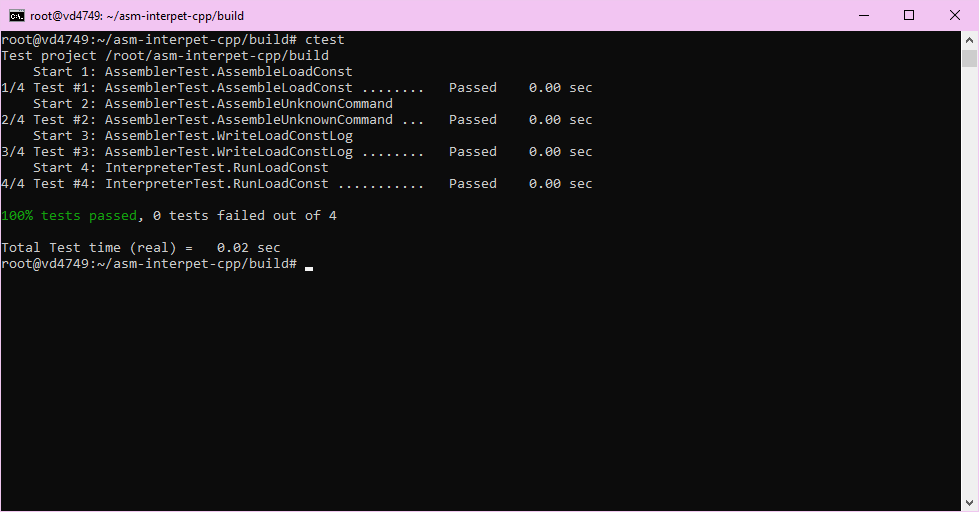

### asm-interpet-cpp

## Общее описание
**asm-interpet-cpp** — это две утилиты для работы с учебной виртуальной машиной (УВМ), включающая ассемблер и интерпретатор. Ассемблер преобразует читаемый текстовый код в бинарный формат, а интерпретатор исполняет бинарные файлы и сохраняет результаты выполнения в указанный диапазон памяти.

---

## Описание всех функций и настроек

### Основные возможности:

#### **Ассемблер**:
- Преобразует читаемый текстовый код в бинарный формат, понятный УВМ.
- Логирует ассемблированные команды в формате XML.
- Поддерживает команды:
  - `LOAD_CONST` — загрузка константы в аккумулятор.
  - `READ_MEM` — чтение значения из памяти.
  - `WRITE_MEM` — запись значения в память.
  - `BIT_NOT` — унарная операция побитового "не".

#### **Интерпретатор**:
- Исполняет бинарные файлы УВМ.
- Поддерживает выполнение вышеуказанных команд.
- Сохраняет значения из памяти в указанном диапазоне в XML-файл.

### Параметры командной строки:

#### Ассемблер:
- `--input` (`-i`): Путь к входному текстовому файлу (обязательный).
- `--output` (`-o`): Путь к выходному бинарному файлу (обязательный).
- `--log` (`-l`): Путь к XML-файлу для логирования.

#### Интерпретатор:
- `--input` (`-i`): Путь к входному бинарному файлу (обязательный).
- `--output` (`-o`): Путь к XML-файлу с результатами выполнения (обязательный).
- `--memory` (`-m`): Диапазон памяти в формате `start:end` (обязательный).

---

## Сборка проекта

### Зависимости:
- **gcc**, **clang** или **msvc** (поддержка C++20 и выше).
- **Conan**.
- **CMake**.

---

### Подготовка профиля Conan:
Для подготовки профиля выполните команду:
```bash
conan profile detect --force
```

Пример профиля для gcc:
```yml
[settings]
arch=x86_64
build_type=Release
compiler=gcc
compiler.cppstd=gnu20
compiler.libcxx=libstdc++11
compiler.version=13
os=Linux
```

---

### Команды для сборки:
1. Создание и настройка окружения:
   ```bash
   mkdir build
   conan install . --output-folder=build --build=missing
   cd build
   cmake .. --preset conan-release
   ```
2. Сборка проекта:
   ```bash
   cmake --build . --config Release
   ```

---

## Примеры использования

### Ассемблер:

#### Пример команды:
```bash
./assembler -i program.txt -o program.bin
```

#### Пример входного файла (`program.txt`):
```text
LOAD_CONST 582
WRITE_MEM 10
READ_MEM 10
BIT_NOT 20 10
```

#### Пример файла лога (`log.xml`):
```xml
<commands>
  <command>
    <name>LOAD_CONST</name>
    <value>582</value>
  </command>
  <command>
    <name>WRITE_MEM</name>
    <address>10</address>
  </command>
  <command>
    <name>READ_MEM</name>
    <address>10</address>
  </command>
  <command>
    <name>BIT_NOT</name>
    <dest>20</dest>
    <src>10</src>
  </command>
</commands>
```

---

### Интерпретатор:

#### Пример команды:
```bash
./interpreter -b program.bin -r result.xml -s0 -e50
```

#### Пример файла результатов (`result.xml`):
```xml
<memory>
  <cell>
    <address>10</address>
    <value>582</value>
  </cell>
  <cell>
    <address>20</address>
    <value>-583</value>
  </cell>
</memory>
```

---

## Результаты тестов

Запуск тестов осуществляется после сборки проекта:
```bash
ctest
```

## Скриншот тестов
